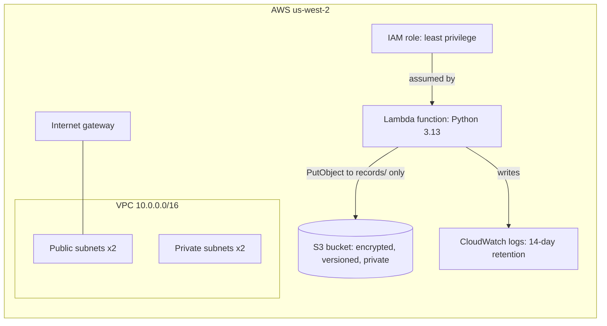

# devsecops-lab

AWS infrastructure built with Terraform, secured by a GitHub Actions pipeline that runs SAST, SCA and IaC scanning and blocks any change that fails a check.

> **Status: in progress.** Infrastructure code for the network, storage and application layers is written and validated. The security pipeline is next.

## Architecture



## What's built

| Module | Resources |
| --- | --- |
| `network` | VPC across two availability zones, public and private subnets, internet gateway, route tables |
| `storage` | S3 bucket with public access blocked, ACLs disabled, versioning, AES256 encryption |
| `app` | Python Lambda function, IAM role, scoped inline policy, CloudWatch log group |

## Security decisions

- **Least-privilege Lambda role.** The function can write to its own log group and upload objects under one prefix of one bucket. It cannot read, delete, or reach any other service.
- **S3 locked down by default.** All four public access block settings on, ACLs disabled with `BucketOwnerEnforced`, versioning and encryption at rest.
- **Default security group locked.** No inbound or outbound rules, so nothing can accidentally use it.
- **No public IPs by default** on public subnets.
- **No NAT Gateway.** Private subnets have no internet route, a deliberate cost and attack-surface decision.
- **Pinned dependencies.** Terraform and provider versions are pinned, and the lock file holds checksums for Linux, macOS and Windows so CI uses verified builds.

## Roadmap

- [x] Terraform modules: network, storage, app
- [ ] GitHub OIDC role so CI needs no stored AWS keys
- [ ] Remote state in S3 with native locking
- [ ] GitHub Actions pipeline: SAST, SCA and IaC scanning that fail the build
- [ ] Compliance as code: CIS mapping, custom policy, documented exceptions, drift detection
- [ ] Deploy to AWS

## Repo layout

```text
app/                  Lambda source code
infra/
  main.tf             Wires the modules together
  providers.tf        Pinned Terraform and provider versions
  variables.tf
  modules/
    network/
    storage/
    app/
```
