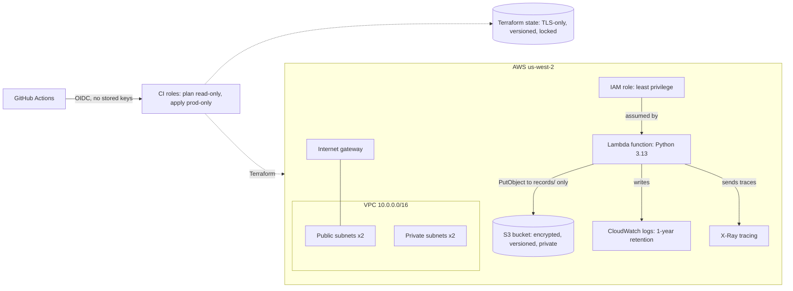

# devsecops-lab

AWS infrastructure built with Terraform, secured by a GitHub Actions pipeline that runs SAST, SCA and IaC scanning and blocks any change that fails a check.

> **Status: in progress.** All infrastructure code is written, validated and security-scanned (Checkov: 106 passed, 0 failed, 7 active exceptions). Every pull request is scanned automatically by GitHub Actions.

## Architecture



## What's built

| Component | Resources |
| --- | --- |
| `network` | VPC across two availability zones, public and private subnets, internet gateway, route tables, locked default security group |
| `storage` | S3 bucket with public access blocked, ACLs disabled, versioning and encryption |
| `app` | Python Lambda function, least-privilege IAM role, CloudWatch log group, X-Ray tracing |
| `github-oidc` | Keyless GitHub Actions login: read-only plan role for pull requests, apply role limited to the `prod` environment |
| `bootstrap` | Hardened Terraform state bucket with S3 native locking |

## Security decisions

- **Least-privilege Lambda role.** The function can write to its own log group, upload objects under one prefix of one bucket, and send traces. Nothing else.
- **Keyless CI.** GitHub Actions authenticates to AWS through OIDC with short-lived credentials. No AWS keys are stored anywhere. Trust policies only accept this repository, and the apply role only accepts the manually approved `prod` environment.
- **S3 locked down by default.** All four public access block settings on, ACLs disabled with `BucketOwnerEnforced`, versioning and encryption at rest.
- **Hardened state.** The state bucket rejects any request not made over TLS, keeps old versions for 90 days, and is protected from deletion with `prevent_destroy`.
- **Default security group locked.** No inbound or outbound rules.
- **No NAT Gateway.** Private subnets have no internet route, a deliberate cost and attack-surface decision.
- **Pinned dependencies.** Terraform and provider versions are pinned, and lock files hold checksums for Linux, macOS and Windows.

## Security scanning

Infrastructure code is scanned with [Checkov](https://www.checkov.io/).

| Result | Count |
| --- | --- |
| Passed | 106 |
| Failed | 0 |
| Documented exceptions | 7 |

The code has 16 `#checkov:skip` comments. Nine of them cover S3 and VPC checks that Checkov 3.3.20 does not run, so only 7 apply in the current scan. They stay in the code to record the decisions in case a future version restores those checks.

Every finding was either fixed or accepted with a written reason. Accepted findings are marked in the code with `#checkov:skip` comments and listed with their compensating controls in [EXCEPTIONS.md](EXCEPTIONS.md).

## Custom policies

`policies/require_tags.yaml` defines **CKV2_LAB_1**, which requires `Project`, `Environment` and `Owner` tags on every taggable AWS resource. CI runs it on every pull request with `--external-checks-dir policies`.

Findings while building it:
- Checkov does not read the AWS provider's `default_tags`, so tags are passed to each module and set on each resource explicitly. `default_tags` remains as a backup.
- When a file fails to parse, Checkov drops its resources from the results instead of failing them. `check.sh` runs first in CI, so a broken file fails the build before the scan can look clean.

CIS AWS Foundations Benchmark coverage is tracked in [CIS_MAPPING.md](CIS_MAPPING.md).

## CI pipeline

Every pull request runs four jobs in GitHub Actions. All actions are pinned to full commit SHAs, and the workflow runs with read-only permissions.

| Job | Tool | Fails the build on |
| --- | --- | --- |
| Terraform | `check.sh` + TFLint | Formatting, invalid code, Terraform mistakes |
| IaC scan | Checkov + custom policies | Any new infrastructure misconfiguration or missing required tag |
| SCA and secrets | Trivy | HIGH or CRITICAL vulnerable dependencies, leaked secrets |
| SAST | Semgrep | Insecure patterns in the Python code |

## Running the checks locally

```bash
./check.sh                                                                           # terraform fmt, init and validate on every root
checkov -d . --framework terraform --external-checks-dir policies --quiet --compact   # security scan with custom policies
```

## Workflow

All changes go through a branch and a pull request, then a squash merge into `main`. Every pull request runs the CI pipeline above, and a failing check blocks the merge.

## Roadmap

- [x] Terraform modules: network, storage, app
- [x] GitHub OIDC roles so CI needs no stored AWS keys
- [x] Remote state bucket and S3 backend with native locking (code complete)
- [x] Checkov scan triaged: findings fixed or documented in `EXCEPTIONS.md`
- [x] GitHub Actions pipeline: SAST, SCA and IaC scanning that fail the build
- [x] Branch protection requiring all checks to pass
- [ ] Compliance as code: CIS mapping ✅, custom policy ✅, drift detection
- [ ] Deploy to AWS

## Repo layout

```text
app/                  Lambda source code
bootstrap/            Terraform state bucket, applied once
infra/
  main.tf             Wires the modules together
  providers.tf        Pinned Terraform and provider versions
  backend.tf          S3 remote state with native locking
  outputs.tf
  variables.tf
  modules/
    network/
    storage/
    app/
    github-oidc/
policies/             Custom Checkov policies
check.sh              One-command Terraform checks
CIS_MAPPING.md        CIS AWS Foundations Benchmark mapping
EXCEPTIONS.md         Security exceptions register
```
